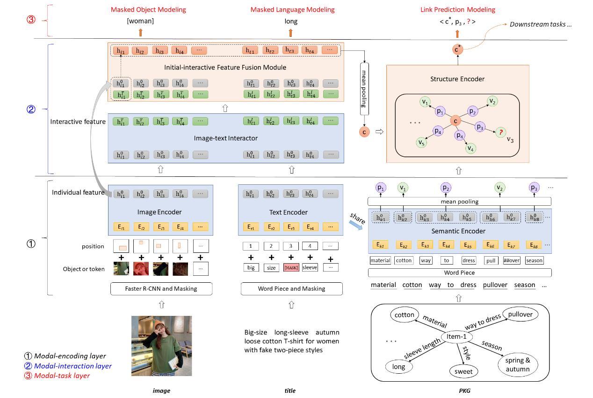

# K3M: A Model of Knowledge Perceived Multi-modal Pretraining in E-commerce

This repository is the official implementation of our multi-modal pretrain model **K3M**, which is model proposed in a paper: **[Knowledge Perceived Multi-modal Pretraining in E-commerce](https://dl.acm.org/doi/pdf/10.1145/3474085.3475648)**, accepted by **ACM MM 2021** main conference. The project is based on an open source framework for multi-modal pretraining [VilBERT](https://github.com/facebookresearch/vilbert-multi-task).

**(Due to the data access problem of Alibaba Group, we cannot open all the data used in paper. In the "data" folder, we release a small data sample for training K3M.)**

# Brief Introduction
Modality-missing and modality-noise are two pervasive problems of multi-modal product data in real E-commerce scenarios. K3M corrects the noise and supplements the missing of image and text modalities by introducing knowledge modality in multi-modal pretraining. K3M learns the multi-modal information of products through three steps :(1) encode the independent information of each mode, corresponding to the modal-coding layer; (2) model the interaction between modes, corresponding to the modal-interaction layer; (3) optimize the model through the supervision information of each mode, corresponding to the modal-task layer.
<div align=center>
</div>


# Environment requirements and how to run our code
### Note: The environment configuration for this project is complex and different environments are required to run the code for the data processing part and the pre-training part. We will introduce the two parts separately. Please strictly configure the environment and run the code step by step according to the following commands.


## Part1: Data Processing (require cuda10.0-10.2 and torch 1.4.0)
```
conda create -n K3M_data python=3.6
conda activate K3M_data
cd K3M
```
**Step1** Process the raw data and download the product images. (Running the following command will generate two files in the "data" folder: "id_title_pvs_cls.txt0" and "id_title_pvs_cls.txt1", the downloaded product images will be saved in the "data/image" folder.)
```
python 0_deal_raw_data_segment.py
```

**Step2** Generate the corresponding JSON file. (Running the following command will generate two files "df_train.csv" and "df_val.csv" and corresponding JSON files in the "data/image_lmdb_json" folder.)
```
python 1_generate_json_ali.py
```

**Step3** Extracting image features. (Run the following commands to install the image feature extraction tool [py-bottom-up-attention](https://github.com/airsplay/py-bottom-up-attention).)
```
pip install pycocotools
pip install jsonlines
pip install -U fvcore
pip install torch==1.4.0
pip install torchvision==0.5.0
pip install cython
pip install opencv-python

git clone https://github.com/cocodataset/cocoapi.git
cd cocoapi/PythonAPI
make
cd ../..

git clone https://github.com/airsplay/py-bottom-up-attention.git
cd py-bottom-up-attention
sudo python setup.py build develop
cd ..
```

Download the pre-trained bottom-up-attention model [faster_rcnn_from_caffe.pkl](http://nlp.cs.unc.edu/models/faster_rcnn_from_caffe.pkl) and put it in the "fast-rcnn-pkl" folder.
```
cd faster-rcnn-pkl
wget http://nlp.cs.unc.edu/models/faster_rcnn_from_caffe.pkl
cd ..
```

Extract image features and store them in TSV files. (Running the following command will generate two files in the "data/image_features" folder: "train.tsv.0" and "dev.tsv.0".)
```
python 2_generate_tsv_ali.py
```

**Step4** Convert the data to the LMDB data format required for pre-training.
Run the following command to install the relevant TensorPack and LMDB packages.
```
pip install tensorpack==0.9.4
pip install lmdb==0.94
```
Generate LMDB files. (Running the following command will generate two files in the "data/image_lmdb_json" folder: "training_feat_all.lmdb" and "validation_feat_all.lmdb".)
```
python 3_generate_lmdb_ali.py
```


## Part 2: Run Pre-training (require cuda10.0-10.2 and torch 1.3.0)
```
conda create -n K3M_train python=3.6
conda activate K3M_train
cd K3M
```
**Step1** Install torch 1.3.0.
```
pip install torch==1.3.0
```

**Step2** Install libpcap-1.10.0.
```
sudo apt-get update
sudo apt-get install m4
sudo apt-get install flex
sudo apt-get install bison
cd libpcap-1.10.0 
./configure
make
sudo make install
sudo apt-get install build-essential libcap-dev
cd ..
```

**Step3** Install other dependency packages.
```
pip install -r requirements.txt
pip install pytorch_transformers==1.1.0
pip install pycocotools
pip uninstall tensorboard
```

**Step4** Download the pre-trained weight file **pytorch_model.bin** of pre-train language model [bert-base-chinese](https://huggingface.co/bert-base-chinese/tree/main) to the "bert-base-chinese" folder.

**Step5** Run the pre-training code.
```
python train_concap_struc.py
```


# Papers for the Project & How to Cite

If you use or extend our work, please cite the following paper:

```
@inproceedings{DBLP:conf/mm/ZhuZZYCZC21,
  author    = {Yushan Zhu and
               Huaixiao Zhao and
               Wen Zhang and
               Ganqiang Ye and
               Hui Chen and
               Ningyu Zhang and
               Huajun Chen},
  editor    = {Heng Tao Shen and
               Yueting Zhuang and
               John R. Smith and
               Yang Yang and
               Pablo Cesar and
               Florian Metze and
               Balakrishnan Prabhakaran},
  title     = {Knowledge Perceived Multi-modal Pretraining in E-commerce},
  booktitle = {{MM} '21: {ACM} Multimedia Conference, Virtual Event, China, October
               20 - 24, 2021},
  pages     = {2744--2752},
  publisher = {{ACM}},
  year      = {2021},
  url       = {https://doi.org/10.1145/3474085.3475648},
  doi       = {10.1145/3474085.3475648},
  timestamp = {Mon, 03 Jan 2022 22:17:05 +0100},
  biburl    = {https://dblp.org/rec/conf/mm/ZhuZZYCZC21.bib},
  bibsource = {dblp computer science bibliography, https://dblp.org}
}
```
