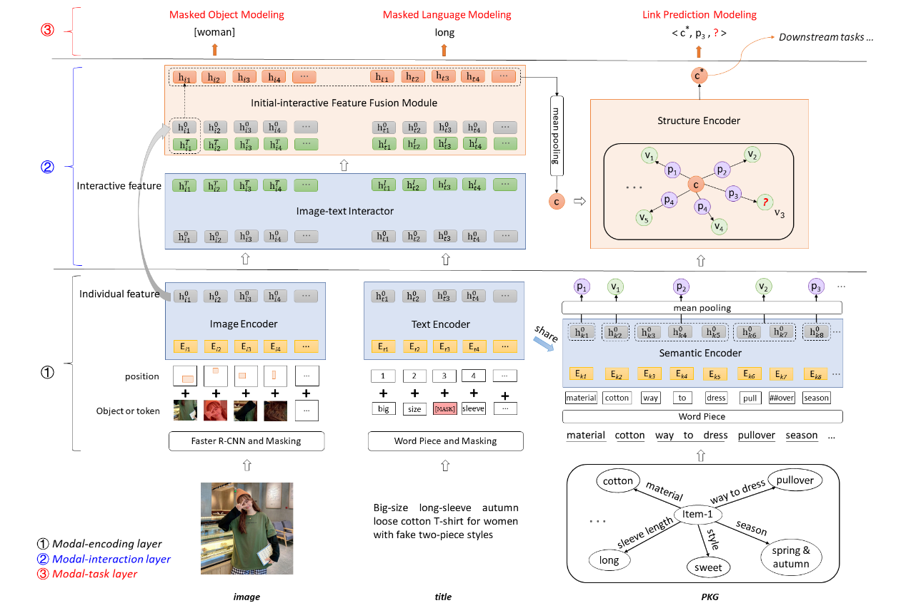

[**中文**](https://github.com/YushanZhu/K3M/blob/main/README_CN.md) | [**English**](https://github.com/YushanZhu/K3M)

<p align="center">
    <a href="https://github.com/zjunlp/openue"> </a>
</p>

# K3M：一个电商场景下知识感知的多模态预训练模型

这是针对我们多模态预训练模型**K3M**的官方实现代码。这个模型是在 **[Knowledge Perceived Multi-modal Pretraining in E-commerce](https://dl.acm.org/doi/pdf/10.1145/3474085.3475648)** 论文中提出来的，该论文已被**ACM MM 2021**主会录用。该项目基于多模态预训练开源框架[VilBERT](https://github.com/facebookresearch/vilbert-multi-task)实现。

# 项目成员
朱渝珊, 鈄怀啸, 张文, 叶橄强, 陈辉, 张宁豫, 陈华钧

# 项目简介
真实电子商务场景中，商品多模态数据的模态缺失和模态噪声是普遍存在的两个问题。K3M是利用知识图谱解决电商场景中多模态预训练模态缺失和模态噪音问题的工作。K3M在多模态预训练中引入知识模态来纠正噪声，补充图像和文本模态的缺失。K3M通过3个步骤学习产品的多模态信息:（1）对每个模态的独立信息进行编码，对应模态编码层，(2)对模态之间的相互作用进行建模，对应模态交互层，（3）通过各个模态的监督信息优化模型，对应模态任务层。
<div align=center>
</div>


# 环境要求以及如何运行我们的代码
### 注意：该项目环境配置较为复杂，运行数据处理部分和预训练部分的代码需要配置不同的环境。两部分我们将分别介绍，请严格按以下命令逐步配置环境并运行代码。


## Part 1: 数据准备部分（要求 cuda10.0-10.2 torch 1.4.0）

```
conda create -n K3M_data python=3.6
conda activate K3M_data
cd K3M
```
**Step1** 处理原始数据，下载图片（运行以下命令将在 data文件夹下生成两个文件：id_title_pvs_cls.txt0 和 id_title_pvs_cls.txt1， 下载的商品图片保存在 data/image 文件夹下）
```
pythton 0_deal_raw_data_segment.py
```

**Step2** 生对应json文件（运行以下命令将在 data/image_lmdb_json 文件夹下生成文件 df_train.csv和df_val.csv，以及相应json文件）
```
python 1_generate_json_ali.py
```

**Step3** 抽取图片特征
需先安装图像特征抽取工具[py-bottom-up-attention](https://github.com/airsplay/py-bottom-up-attention)
```
pip install pycocotools
pip install jsonlines
pip install -U fvcore
pip install torch==1.4.0
pip install torchvision==0.5.0
pip install cython
pip install opencv-python

git clone https://github.com/cocodataset/cocoapi.git
cd cocoapi/PythonAPI
make
cd ../..

git clone https://github.com/airsplay/py-bottom-up-attention.git
cd py-bottom-up-attention
sudo python setup.py build develop
cd ..
```

下载预训练的bottom-up-attention模型 [faster_rcnn_from_caffe.pkl](http://nlp.cs.unc.edu/models/faster_rcnn_from_caffe.pkl) 并放到 faster-rcnn-pkl 文件夹下.
```
cd fast-rcnn-pkl
wget http://nlp.cs.unc.edu/models/faster_rcnn_from_caffe.pkl
cd ..
```

抽取图片特征并存入tsv文件（运行以下命令将在 data/image_features 文件夹下生成两个文件：train.tsv.0和 dev.tsv.0）
```
python 2_generate_tsv_ali.py
```

**Step4** 转换成预训练需要的lmdb数据格式
运行以下命令安装相关tensorpack和lmdb包
```
pip install tensorpack==0.9.4
pip install lmdb==0.94
```
生成lmdb文件（运行以下命令将在 data/image_lmdb_json 文件夹下生成两个文件：training_feat_all.lmdb和 validation_feat_all.lmdb）
```
python 3_generate_lmdb_ali.py
```


## Part 2: 预训练部分 （要求 cuda10.0-cuda10.2 torch 1.3.0）
```
conda create -n K3M_train python=3.6
conda activate K3M_train
cd K3M
```
**Step1** 安装 torch 1.3.0
```
pip install torch==1.3.0
```

**Step2** 安装 libpcap-1.10.0
```
cd libpcap-1.10.0 
sudo apt-get update
sudo apt-get install m4
sudo apt-get install flex
sudo apt-get install bison
./configure
make
sudo make install
sudo apt-get install build-essential libcap-dev
cd ..
```

**Step3** 安装其他包
```
pip install -r requirements.txt
pip install pytorch_transformers==1.1.0
pip install pycocotools
pip uninstall tensorboard
```

**Step4** 下载预训练语言模型 [bert-base-chinese](https://huggingface.co/bert-base-chinese/tree/main) 到项目根目录下。


**Step5** 运行预训练代码
```
python train_concap_struc.py
```

# 预训练模型下载

您也可以通过以下链接下载我们预训练好的项目模型：

在阿里千万级商品上预训练的K3M模型[K3M model](https://github.com/zjukr/KGPretrain/blob/main/K3M/)即将发布。


# 结果
我们的预训练模型在3个下游任务（商品分类，产品对齐，多模态问答）上的结果
- 商品分类
<div align=center></div>
- 产品对齐 
<div align=center></div>
- 多模态问答
<div align=center></div>

更多详细结果请参考论文。


# 有关论文

如果您使用或拓展我们的工作，请引用以下论文：

```
@inproceedings{DBLP:conf/mm/ZhuZZYCZC21,
  author    = {Yushan Zhu and
               Huaixiao Zhao and
               Wen Zhang and
               Ganqiang Ye and
               Hui Chen and
               Ningyu Zhang and
               Huajun Chen},
  editor    = {Heng Tao Shen and
               Yueting Zhuang and
               John R. Smith and
               Yang Yang and
               Pablo Cesar and
               Florian Metze and
               Balakrishnan Prabhakaran},
  title     = {Knowledge Perceived Multi-modal Pretraining in E-commerce},
  booktitle = {{MM} '21: {ACM} Multimedia Conference, Virtual Event, China, October
               20 - 24, 2021},
  pages     = {2744--2752},
  publisher = {{ACM}},
  year      = {2021},
  url       = {https://doi.org/10.1145/3474085.3475648},
  doi       = {10.1145/3474085.3475648},
  timestamp = {Mon, 03 Jan 2022 22:17:05 +0100},
  biburl    = {https://dblp.org/rec/conf/mm/ZhuZZYCZC21.bib},
  bibsource = {dblp computer science bibliography, https://dblp.org}
}
```

